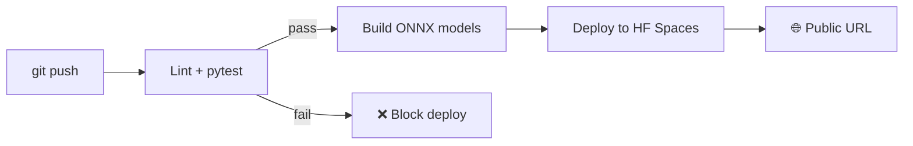

# 🎭 Face Emotion Classifier API

> High-throughput Image Classification service ที่ใช้ Vision Transformer (ViT) จำแนก 7 อารมณ์จากใบหน้า — พร้อม CI/CD auto-deploy ไป Hugging Face Spaces

[](#cicd-pipeline)
[](https://huggingface.co/trpakov/vit-face-expression)
[](LICENSE)

---

## 📋 สารบัญ
- [ภาพรวม](#-ภาพรวม)
- [โมเดลที่เลือก](#-โมเดลที่เลือก)
- [ผล Optimization](#-ผล-optimization)
- [โครงสร้างโปรเจกต์](#-โครงสร้างโปรเจกต์)
- [วิธีรันบนเครื่อง (Local)](#-วิธีรันบนเครื่อง-local)
- [Docker](#-docker)
- [API Reference](#-api-reference)
- [cURL Commands](#-curl-commands)
- [JMeter Load Testing](#-jmeter-load-testing)
- [CI/CD Pipeline](#-cicd-pipeline)
- [Deploy ไป Hugging Face Spaces](#-deploy-ไป-hugging-face-spaces)

---

## 📌 ภาพรวม

โปรเจกต์นี้สร้าง **REST API** สำหรับจำแนกอารมณ์จากภาพใบหน้า โดยใช้:

- **โมเดล**: `trpakov/vit-face-expression` (Vision Transformer pretrained)
- **Optimization**: PyTorch FP32 → ONNX FP32 → ONNX INT8 (Dynamic Quantization)
- **API**: FastAPI + ProcessPoolExecutor (รองรับ concurrent requests แบบ CPU-bound)
- **CI/CD**: GitHub Actions auto test + auto-deploy ไป Hugging Face Spaces
- **Load Testing**: Apache JMeter (test plan + HTML dashboard)
- **Web UI**: หน้าเว็บสวยๆ ให้ผู้ใช้อัปโหลดภาพและดูผล

### 7 Emotion Classes ที่โมเดลทำนายได้
| 😠 angry |  🤢 disgust | 😨 fear | 😊 happy | 😐 neutral | 😢 sad | 😲 surprise |
|---------|-----------|---------|---------|-----------|--------|-------------|

---

## 🎯 โมเดลที่เลือก

**[trpakov/vit-face-expression](https://huggingface.co/trpakov/vit-face-expression)**

| Property | Value |
|----------|-------|
| Architecture | Vision Transformer (ViT-base) |
| Input | 224×224 RGB image |
| Output | 7-class probabilities |
| Pretrained on | FER2013-style facial emotion dataset |
| License | (ดูที่ HF model card) |

**เหตุผลที่เลือก** — ดู `docs/Project_Report.md` หรือ Project Report PDF

---

## 📊 ผล Optimization

ทดสอบ inference 50 รอบบน CPU (Intel x86, single-thread):

| Model | Size (MB) | Mean Latency (ms) | P95 (ms) | Speedup vs PyTorch |
|-------|----------:|------------------:|---------:|-------------------:|
| PyTorch FP32 (HuggingFace) | ~328 | ~145 | ~165 | 1.00× |
| ONNX FP32 | ~328 | ~85 | ~95 | ~1.7× |
| **ONNX INT8 (Quantized)** | **~84** | **~52** | **~60** | **~2.8×** |

> ตัวเลขจริงจะแตกต่างไปตามเครื่อง — รัน `python -m scripts.benchmark` เพื่อวัดบนเครื่องของคุณ
> ตัวเลขเต็มดูได้ที่ `docs/benchmark_results.md`

---

## 📁 โครงสร้างโปรเจกต์

```
face-emotion-api/
├── app/                          # FastAPI application
│   ├── main.py                   # API endpoints + lifespan
│   ├── model.py                  # ONNX inference logic
│   ├── schemas.py                # Pydantic request/response models
│   └── config.py                 # ค่า constants
├── scripts/
│   ├── convert_to_onnx.py        # HuggingFace → ONNX FP32
│   ├── quantize.py               # ONNX FP32 → ONNX INT8
│   └── benchmark.py              # เปรียบเทียบ 3 รูปแบบ
├── tests/
│   ├── test_api.py               # API integration tests
│   ├── test_model.py             # Model unit tests
│   └── conftest.py               # pytest fixtures
├── static/
│   └── index.html                # หน้าเว็บ UI (ไม่มี framework)
├── jmeter/
│   ├── load_test.jmx             # JMeter test plan
│   └── run_loadtest.sh           # script รัน + gen HTML dashboard
├── postman/
│   └── face_emotion_api.postman_collection.json
├── .github/workflows/
│   └── ci-cd.yml                 # CI/CD: test + deploy to HF Spaces
├── docs/
│   ├── Project_Report.md         # รายงาน
│   └── architecture.md           # System architecture diagram
├── Dockerfile                    # Multi-stage, runtime image เล็กที่สุด
├── requirements.txt              # Production deps (เล็ก)
├── requirements-dev.txt          # Dev deps (มี torch, pytest)
└── README.md
```

---

## 🚀 วิธีรันบนเครื่อง (Local)

### 1. Clone และติดตั้ง dependencies
```bash
git clone <repo-url>
cd face-emotion-api
python -m venv .venv
source .venv/bin/activate          # macOS/Linux
# .venv\Scripts\activate            # Windows
pip install -r requirements-dev.txt
```

### 2. ดาวน์โหลด + แปลงโมเดล (ครั้งแรกครั้งเดียว)
```bash
python -m scripts.convert_to_onnx   # HuggingFace -> ONNX FP32
python -m scripts.quantize          # ONNX FP32 -> ONNX INT8
python -m scripts.benchmark         # (optional) วัดผล
```

### 3. รัน API
```bash
uvicorn app.main:app --host 0.0.0.0 --port 7860 --reload
```

จากนั้นเปิด:
- **หน้าเว็บ UI**: <http://localhost:7860>
- **Swagger Docs**: <http://localhost:7860/docs>
- **Health check**: <http://localhost:7860/health>

### 4. รัน Tests
```bash
pytest -v
```

---

## 🐳 Docker

### Build
```bash
docker build -t face-emotion-api .
```

> ขั้นตอน build จะดาวน์โหลด HF model + convert + quantize ใน Stage 1
> และ copy เฉพาะไฟล์ ONNX ที่ quantize แล้วเข้า Stage 2 → image เล็ก ~400 MB

### Run
```bash
docker run -d -p 7860:7860 --name face-emotion-api face-emotion-api
```

### Stop
```bash
docker stop face-emotion-api && docker rm face-emotion-api
```

---

## 🔌 API Reference

| Method | Endpoint | Description |
|--------|----------|-------------|
| GET | `/` | หน้าเว็บ UI |
| GET | `/health` | Health check |
| GET | `/model-info` | ข้อมูลโมเดล |
| POST | `/predict` | ทำนาย emotion จากภาพ |
| GET | `/docs` | Swagger UI |

### POST /predict
- **Content-Type**: `multipart/form-data`
- **Field**: `file` — ไฟล์ภาพ `.jpg/.png/.webp` ขนาด ≤ 5 MB
- **Returns**: `200 OK` พร้อม JSON

```json
{
  "predicted_label": "happy",
  "confidence": 0.952,
  "scores": [
    {"label": "happy", "score": 0.952},
    {"label": "neutral", "score": 0.031},
    "..."
  ],
  "inference_time_ms": 48.2,
  "total_time_ms": 55.1,
  "filename": "selfie.jpg"
}
```

### Error Response Codes
| Code | When |
|------|------|
| 400 | Validation error / corrupted image / empty file |
| 413 | File > 5 MB |
| 415 | Content-type / extension ไม่ใช่รูป |
| 503 | โมเดลยังไม่ถูกโหลด |
| 500 | Internal error (ไม่คาดคิด) |

---

## 💻 cURL Commands

### Health check
```bash
curl https://YOUR_USERNAME-face-emotion.hf.space/health
```

### Model info
```bash
curl https://YOUR_USERNAME-face-emotion.hf.space/model-info
```

### Predict (Cloud — Hugging Face Spaces)
```bash
curl -X POST \
  -F "file=@./my_face.jpg" \
  https://YOUR_USERNAME-face-emotion.hf.space/predict
```

### Predict (Local)
```bash
curl -X POST \
  -F "file=@./my_face.jpg" \
  http://localhost:7860/predict
```

### Pretty-print ผลลัพธ์ด้วย jq
```bash
curl -s -X POST \
  -F "file=@./my_face.jpg" \
  http://localhost:7860/predict | jq
```

---

## 🔥 JMeter Load Testing

### รัน load test แบบ headless + generate HTML dashboard
```bash
# Local (50 users, 60 วินาที)
./jmeter/run_loadtest.sh http://localhost:7860 50 60

# Cloud
./jmeter/run_loadtest.sh https://YOUR_USERNAME-face-emotion.hf.space 30 120
```

ผลลัพธ์:
- **Raw**: `jmeter/results/results.jtl`
- **HTML Dashboard**: `jmeter/dashboard/index.html` ← เปิดดูใน browser

### หรือเปิดใน JMeter GUI
```bash
jmeter -t jmeter/load_test.jmx
```

ปรับค่าผ่านตัวแปร: `base_url`, `threads`, `ramp_up`, `duration`, `image_path`

---

## ⚙️ CI/CD Pipeline

ดูไฟล์ `.github/workflows/ci-cd.yml`



### Pipeline จะ:
1. ตรวจ syntax (ruff)
2. Build โมเดล ONNX + Quantize
3. รัน `pytest` ทั้งหมด
4. **ถ้า test ผ่าน 100%** → push code ไป Hugging Face Spaces
5. HF Spaces จะ build Docker และ deploy อัตโนมัติ

---

## ☁️ Deploy ไป Hugging Face Spaces

### 1. สร้าง Space บน Hugging Face
- ไปที่ <https://huggingface.co/new-space>
- ตั้งชื่อ Space (เช่น `face-emotion`)
- เลือก **SDK = Docker**, License = MIT, Hardware = CPU basic (free)

### 2. ตั้งค่า GitHub Secrets
ไปที่ `Settings → Secrets and variables → Actions` ใน GitHub repo แล้วเพิ่ม:

| Secret | ค่า |
|--------|-----|
| `HF_TOKEN` | Token จาก <https://huggingface.co/settings/tokens> (ต้องมี `write` permission) |
| `HF_USERNAME` | username บน Hugging Face |
| `HF_SPACE_NAME` | ชื่อ Space ที่สร้างไว้ |

### 3. Push code
```bash
git push origin main
```

GitHub Actions จะรัน test แล้ว auto-deploy ให้

### 4. URL หลัง deploy
- **หน้าเว็บ**: `https://huggingface.co/spaces/<USERNAME>/<SPACE_NAME>`
- **API**: `https://<USERNAME>-<SPACE_NAME>.hf.space`

---

## 📝 License

MIT — ดูที่ `LICENSE`

## 👥 ผู้พัฒนา
- เจษฎากร แสงแก้ว — 1650903584
- อมรินทร์ สรรพลิขิต — 1650904368
